# Agents Company for HappyCapy

**AI Multi-Agent Orchestration System based on the ancient Chinese "Three Departments and Seven Ministries" governance model.**

10 specialized AI Agents collaborate through a structured hierarchy: Strategy Hub plans, Review Hub audits, Execution Hub dispatches, and 7 Ministries handle domain-specific work -- all coordinated through a real-time dashboard.

<p align="center">
  
  
  
  
  
  
</p>

---

## Quick Start

**One-line install:**

```bash
curl -fsSL https://raw.githubusercontent.com/rogerhorsley/agents_company_for_happycapy/main/setup.sh | bash
```

**Or manually:**

```bash
git clone https://github.com/rogerhorsley/agents_company_for_happycapy.git
cd agents_company_for_happycapy
chmod +x install.sh && ./install.sh
```

**Start the dashboard:**

```bash
python3 dashboard/server.py
# Open http://127.0.0.1:7891
```

---

## Architecture

```
                    +------------------+
                    |   Strategy Hub   |  Plan & Research
                    |     (策枢)       |
                    +--------+---------+
                             |
                    +--------v---------+
                    |   Review Hub     |  Audit & Approve
                    |     (衡枢)       |
                    +--------+---------+
                             |
                    +--------v---------+
                    |  Execution Hub   |  Dispatch & Monitor
                    |     (行枢)       |
                    +---+----+----+----+
                        |    |    |
          +-------------+    |    +-------------+
          |                  |                  |
   +------v------+   +------v------+   +-------v-----+
   | Research (谋)|   |  HR (人)    |   | Finance (财) |
   | Brand (品)   |   | Security(安)|   | Compliance(规)|
   | Tech (技)    |   |             |   |              |
   +-------------+   +-------------+   +--------------+
```

### 10 Agents

| Agent | ID | Role |
|-------|----|------|
| Strategy Hub | `strategy` | Strategic planning, task decomposition |
| Review Hub | `review` | Quality audit, approval/rejection |
| Execution Hub | `execution` | Task dispatch to ministries |
| Research Ministry | `research` | Research, analysis, investigation |
| HR Ministry | `hr` | Personnel, recruitment, evaluation |
| Finance Ministry | `finance` | Budget, cost analysis, ROI |
| Brand Ministry | `brand` | Content, marketing, PR |
| Security Ministry | `security` | Security audit, risk assessment |
| Compliance Ministry | `compliance` | Policy, regulation, standards |
| Tech Ministry | `tech` | Engineering, implementation, DevOps |

---

## Features

### Dashboard (Real-time Control Panel)

- **Task Board** -- Task cards with state tracking (Draft/Review/Doing/Done)
- **Department Monitor** -- Live agent status and workload
- **Court Discussion** -- Multi-agent collaborative deliberation
- **Official Overview** -- Agent profiles and performance stats
- **Model Config** -- Switch LLM models per agent
- **Skills Config** -- Manage agent skills and tools
- **Sessions** -- View and manage sub-tasks
- **Memorial Hall** -- Archived completed tasks
- **Template Library** -- Reusable task templates
- **Morning Brief** -- Daily intelligence summary via Feishu

### System Setup (New)

- **OpenClaw Detection** -- Auto-detect local OpenClaw installation, inherit memory/config
- **Channel Config** -- Feishu webhook management (add/edit/test/delete channels)
- **HappyCapy Login** -- User authentication with personal API keys and model selection

### Screenshots

| Task Board | Dispatch | Court Discussion |
|-----------|---------|-------------|
| 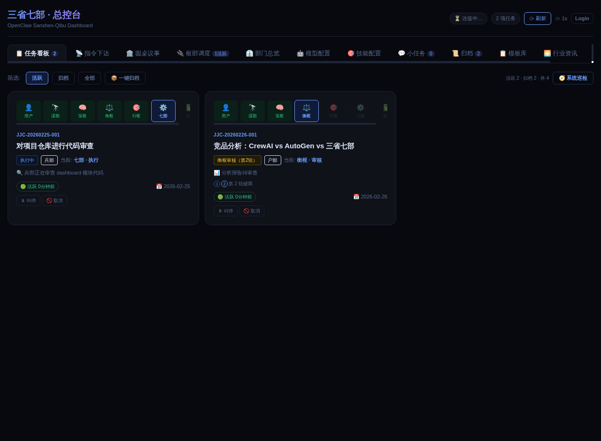 | 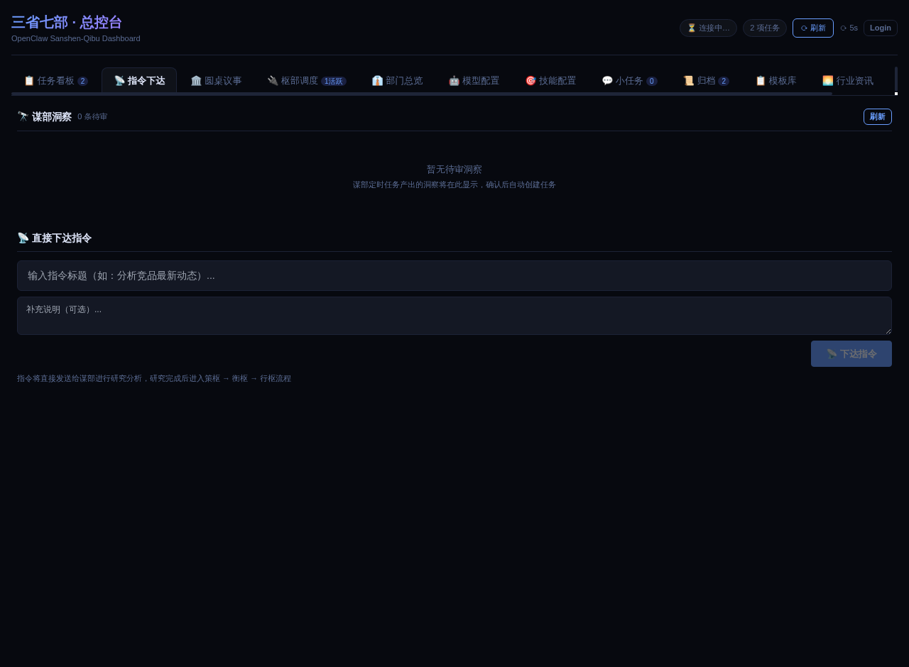 | 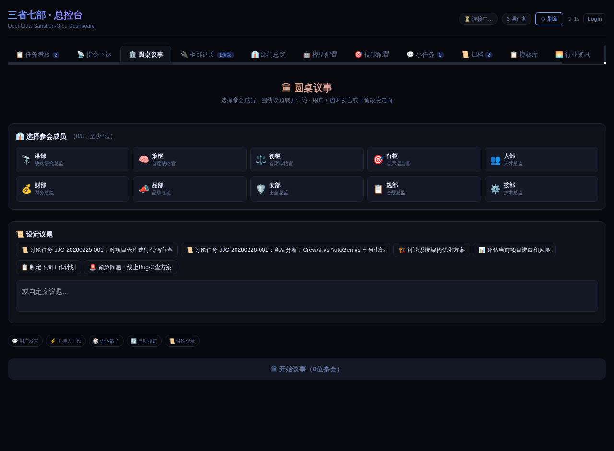 |

| Hub Monitor | Official Overview | Model Config |
|-----------|---------|-------------|
| 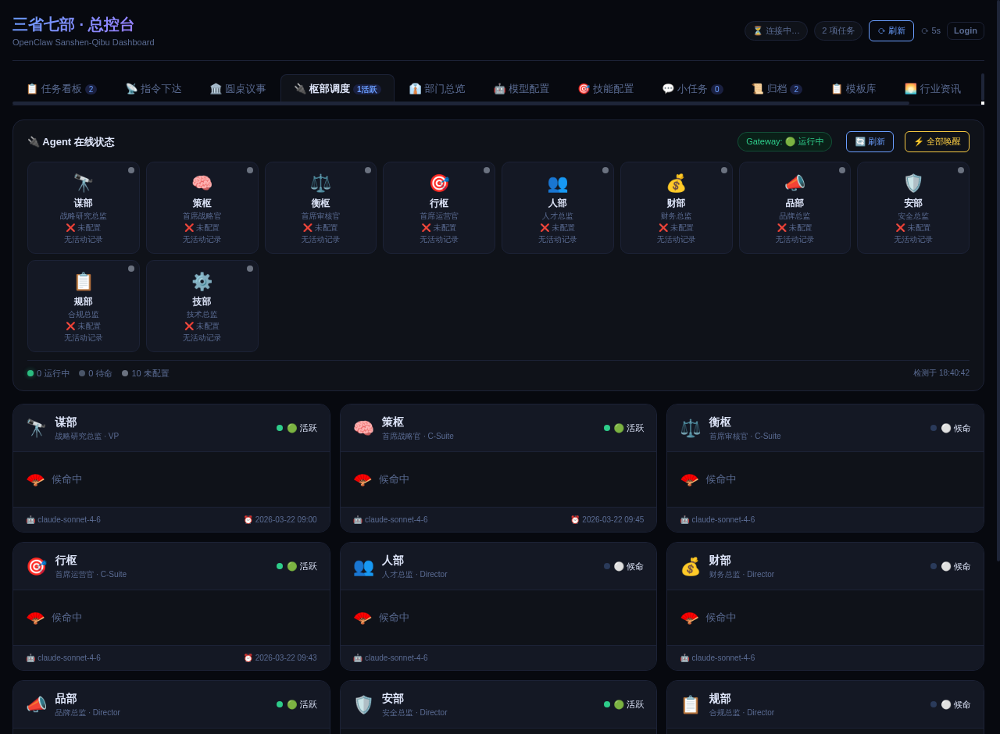 | 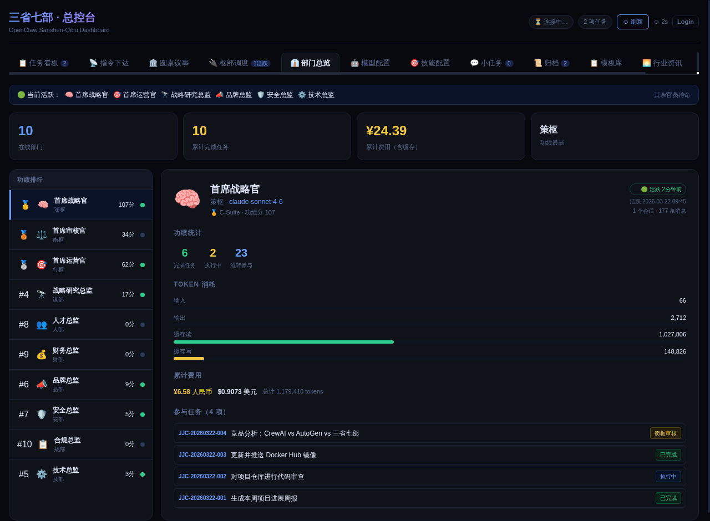 | 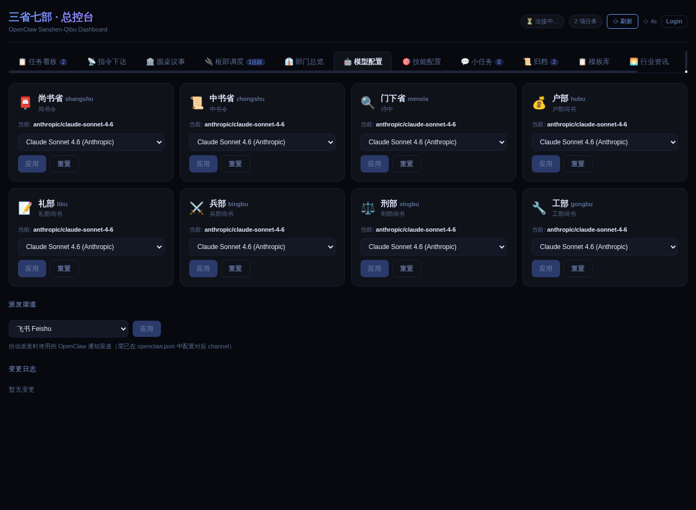 |

| Skills Config | Sessions | Memorials |
|-----------|---------|-------------|
| 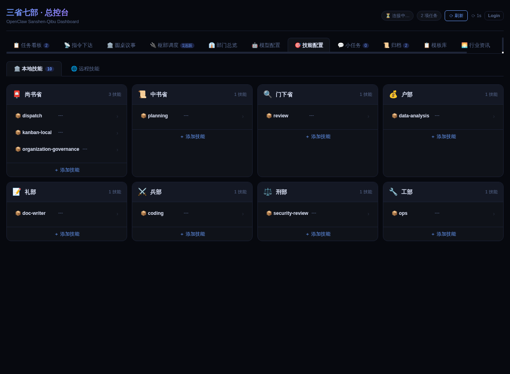 | 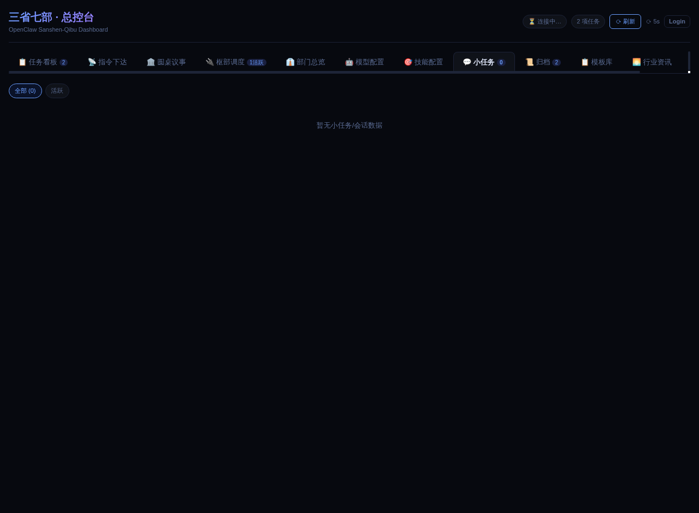 | 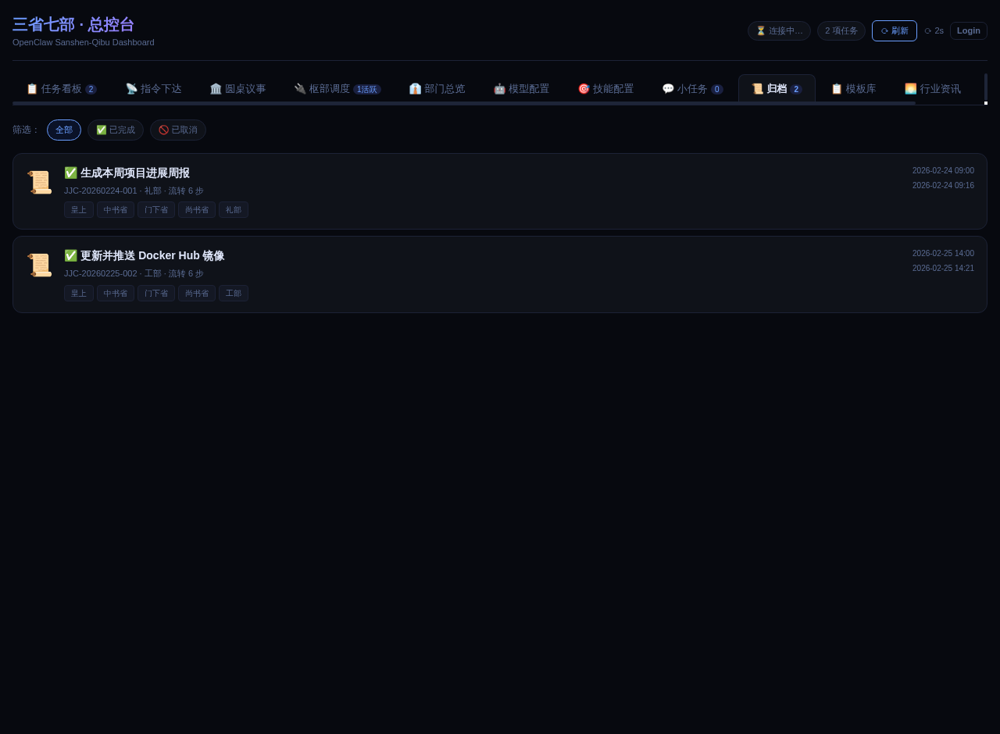 |

| Templates | Morning Brief | System Setup |
|-----------|---------|-------------|
| 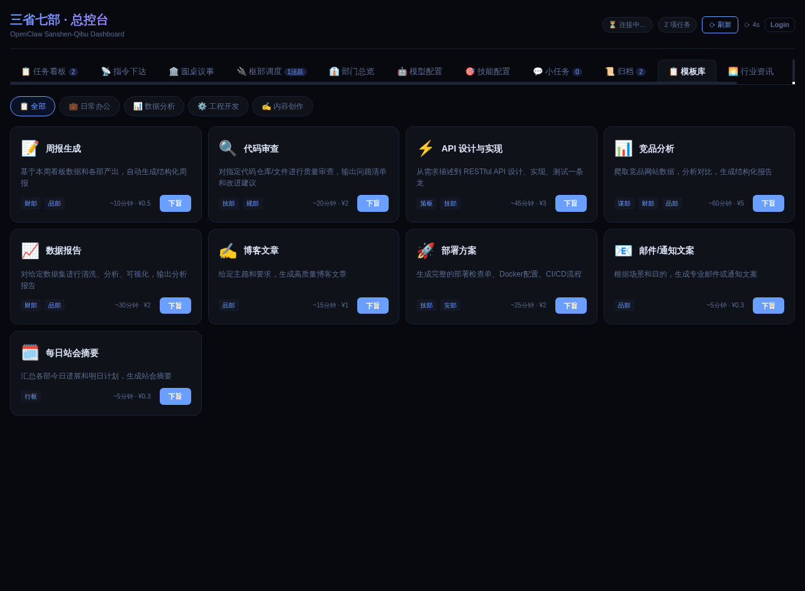 | 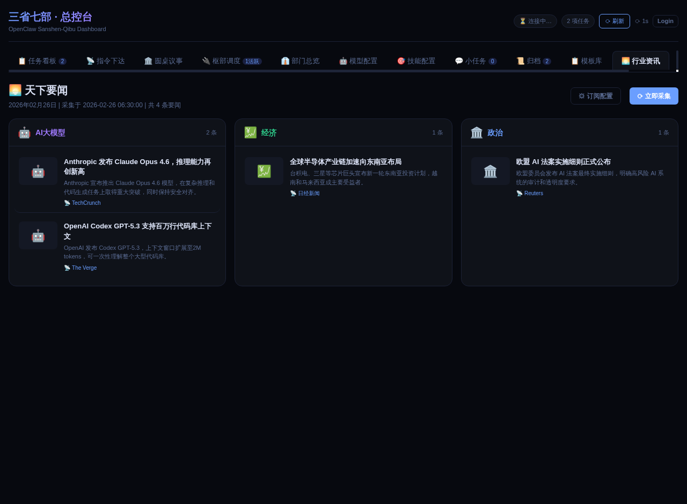 | 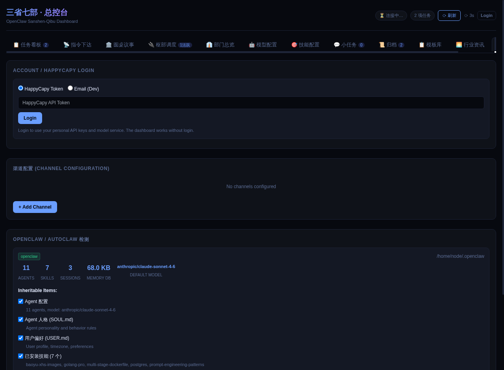 |

---

## Tech Stack

| Layer | Technology |
|-------|-----------|
| Frontend | React 18 + TypeScript + Vite + Zustand |
| Backend | Python stdlib (`http.server`) -- zero dependencies |
| Agent Runtime | OpenClaw |
| Auth | JWT (HMAC-SHA256, stdlib only) |
| Storage | JSON files (lightweight, no DB required) |
| Channels | Feishu (Lark) webhook integration |

---

## Project Structure

```
agents_company_for_happycapy/
  agents/              # 10 agent SOUL.md definitions
  dashboard/           # Backend server + built frontend
    server.py          # API server (stdlib HTTP)
    dist/              # Built React frontend
  app/
    frontend/          # React 18 source (TypeScript)
    backend/           # FastAPI backend (optional)
    migration/         # Database migration scripts
    scripts/           # Internal utilities
  scripts/             # Sync, refresh, and automation scripts
  data/                # Runtime data (gitignored)
  docs/                # Documentation and screenshots
  install.sh           # Local installer
  setup.sh             # Remote one-line installer
```

---

## Configuration

### Environment Variables

| Variable | Description | Default |
|----------|-------------|---------|
| `AC_JWT_SECRET` | JWT signing secret | Auto-generated (ephemeral) |
| `CAPY_BASE_URL` | HappyCapy API base URL | -- |
| `CAPY_SECRET` | HappyCapy API secret | -- |
| `CAPY_USER_ID` | HappyCapy user ID | -- |

### CLI Shortcuts (after install)

```bash
ac-dashboard     # Start dashboard on port 7891
ac-sync          # Start background data sync loop
ac-update        # Pull latest and reinstall
```

---

## Docker

```bash
docker compose up
# or
docker run -p 7891:7891 rogerhorsley/agents_company_for_happycapy
```

---

## Contributing

See [CONTRIBUTING.md](CONTRIBUTING.md) for guidelines.

---

## License

MIT License. See [LICENSE](LICENSE).

---

<sub>Based on the open source project [cft0808/edict](https://github.com/cft0808/edict).</sub>
